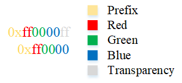

#Image merger

###Description
This project was created for merging pictures.

###How it works

You need to create a folder that will contain pictures of 
the same size. Then specify the path to this folder, the 
program reads given pictures sequentially. Then it is 
necessary to indicate the path with filename of saving. 
If desired, the color of the canvas on which the photos 
will be superimposed.<br> 
_Merging is performed from left to right_.<br>
Pictures are arranged in such a way `min(abs(imgWidth * 
imgNumber1 - imgHeight * imgNumber2))`. Wherein `imgNumber1 *
imgNumber2 >= images`.

###Example

The images were **980 width** and **1141 height** in the 
example below.

```
Path to merge: c:/pictures1
Path to save: c:/pic1.png 0xff0000
LOG: sizes 7 7
LOG: canvas was filled
LOG: images were merged
LOG: format .png
Successfully saved
Elapsed time: 41.337 s

Path to merge: c:/pictures1
Path to save: c:/pic2.jpg
LOG: sizes 7 7
LOG: canvas was filled
LOG: images were merged
LOG: format .jpg
Successfully saved
Elapsed time: 13.956 s
```
The entered number means (red color):



You can also enter numbers in decimal form. Without 
specifying the number, the canvas will be transparent.

For the example with sizes **1727 width** and **941 height**,
the size will be **6** by **11** pictures. There will be 
an empty space of **4** pictures at the bottom of the 
combined picture.